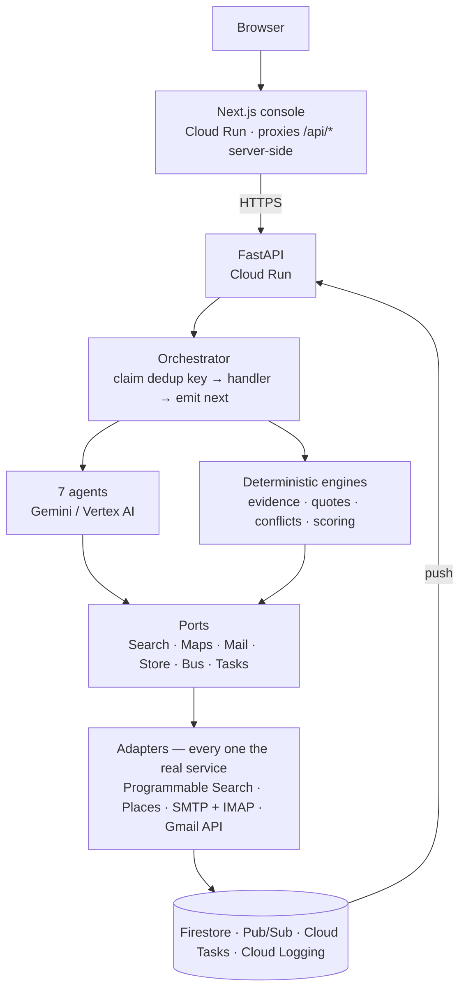
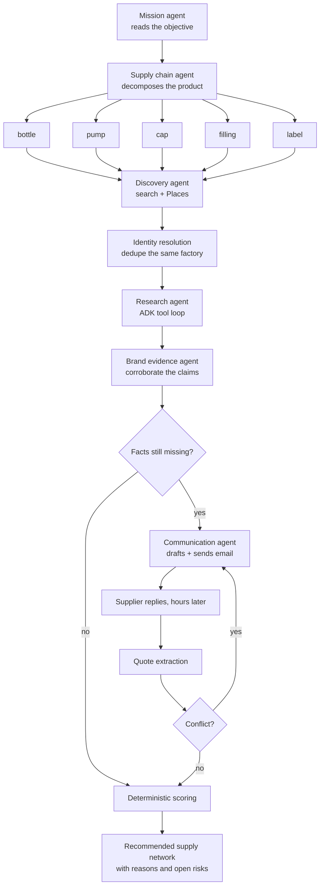

# 🧭 SupplyMe — Autonomous Supplier Discovery

An agentic sourcing system that turns *"I want to make this product"* into a
qualified supply network — discovering suppliers, reading what they publish,
emailing them, chasing replies for days, and reporting **where every single
number came from**.

Built for the Google × Devpost **All Things Agentic** hackathon, category
**The Taskmaster**.

## 🎯 Project Overview

Sourcing information is not published, it is *disclosed* — differently to
different people, in a negotiation. There is no dataset. The only way to learn a
supplier's real minimum order is to ask them, and the only way to know whether
their claims hold is to find somebody other than them saying it.

SupplyMe runs that investigation end to end: it **decomposes a product into the
supply chain it needs**, **finds candidate manufacturers**, **researches each one
against the live web**, **emails what it cannot find out**, **resolves
contradictions**, and **ranks the survivors** with a deterministic score it can
explain line by line.

Two moments show what that buys you:

- **Two suppliers claim the same major fragrance brand as a customer.** One is
  corroborated by the brand's own site and a trade publication; the other is the
  supplier's word and nothing else. They are reported differently, and never as
  the same thing.
- **A supplier's website says MOQ 500; their email says 1,000.** Rather than
  asking again, the system puts both numbers back to them in one targeted
  follow-up — *"your published minimum is 500 but we were quoted 1,000 — is 500
  possible as a pilot?"* — and re-scores them on the answer.

Most of the wall-clock time in that job is spent waiting for a human to reply.
That is a bad fit for search, and a good fit for an agent.

## 🏗️ Architecture



Every component drawn above is implemented. Nothing in the pipeline is a single
long LLM call — **each arrow is a persisted event**, so a Cloud Run restart mid
mission loses nothing and a supplier replying three days later resumes the same
mission.

### Core Components

- **🧠 [Backend API](./backend/README.md)** — FastAPI, the orchestrator, the seven agents, and the deterministic engines
- **🖥️ Console** (`frontend/`) — Next.js 15 dashboard; every fact clickable back to its source excerpt
- **📬 Mail loop** (`app/adapters/`) — SMTP out, IMAP in, or Gmail API push; replies re-enter the workflow by `In-Reply-To`
- **☁️ Infrastructure** (`terraform/`) — OpenTofu; Cloud Run, Firestore, Pub/Sub, Cloud Tasks, Secret Manager, budgets

### Agent Workflow



The routing decision is the whole product: `handle_vendor_updated` in
`app/workflow/handlers.py` reads a supplier's current state and picks the next
move — qualify, reject, email, or wait — and no part of that is scripted by the
user.

### One system, any product

Nothing in `app/` knows what a bottle is. The supply-chain agent decomposes the
product into nodes, and each node carries the words a supplier in *that*
industry writes on a quotation — `botol`, `flacon`; `PCBA`, `board`; `papan
kayu`. That list is the mission's **component vocabulary**
(`domain/quotes.ComponentVocabulary`), and it is what lets a reply be matched to
the question that asked it.

It replaced a hardcoded alias table. The table only ever held one industry's
words, so a furniture supplier pricing `papan kayu jati` looked like a supplier
who had not answered — and worse, a fixed three-component bundle rule meant any
supplier in any other industry who quoted one bundled price was silently
uncomparable. What a bundle contains is now the supplier's statement, recorded
from their reply; a bundle they did not explain is reported as uncomparable
rather than assumed.

One plan, from a live run against *"a 1.5m solid oak dining table for export
from Vietnam"* — a product this code has never been told anything about:

```
fsc-oak-lumber              FSC oak · gỗ sồi FSC · oak lumber · solid oak board
woodworking-and-finishing   wood machining · gia công gỗ · PU finishing · sơn PU
kd-hardware                 KD fittings · phụ kiện ngành gỗ · connecting bolts
flatpack-packaging          carton box · thùng carton · flatpack box
```

None of those words appears anywhere in `app/`, in any language. The plan is
regenerated per mission, so a second run words it differently — what is fixed is
that the vocabulary comes from the plan and not from a table. The only component
vocabulary the code ships with is that `set`, `paket` and `kit` all mean
`package`, because bundling is a property of quotations rather than of an
industry.

## ✨ Key Features

### Autonomous Investigation
- **Any physical product** — a 50ml EDP, an oak dining table, a run of hoodies, a power bank. The supply chain is derived from the product, and so is the vocabulary used to read the quotes that come back; no industry is built in
- **Parallel discovery** — every supply-chain node is searched at once, bounded so a mission cannot rate-limit itself
- **Agentic research** — a Google ADK `LlmAgent` chooses which page to read next based on what the last one said, and stops when it can answer
- **Identity resolution** — the same factory listed under three names becomes one supplier

### Evidence With Provenance
- **The model extracts claims; it never rates them** — `app/domain/evidence.py` scores a claim from its source and nothing else
- **Provenance on every displayed fact** — `verified`, `direct quote`, `published`, `inferred`, `sources differ`, `unknown`. Six states, because six is what the evidence engine can actually compute; a badge for a seventh would be a claim about the system rather than about the fact
- **Diminishing returns** — twenty directory listings copying one press release score *lower* than the manufacturer's own spec sheet
- **Click through to the excerpt** — verbatim text, URL, and retrieval time, in the console

### Outreach That Closes The Loop
- **Asks only what is missing** — threads track asked / answered / unanswered questions
- **Conflict-driven follow-ups** — contradictions become one targeted question, not a repeat of all eight
- **Reply matching by mail headers** — `Message-ID` / `In-Reply-To`, so a redirected test mailbox still resolves to the right mission
- **No polling of a browser** — Cloud Scheduler pings the mailbox, or Gmail pushes to Pub/Sub; the tab can be closed

### Explainable Ranking
- **Deterministic scoring, never a model score** — price 20% · MOQ fit 20% · capability 20% · lead time 15% · evidence 15% · logistics 10%
- **Weights follow your objective** — *"minimize risk on the first batch"* moves weight onto MOQ fit and off price
- **A sentence per component** — `MOQ 500 fits an order of 500`, not a bar
- **Logistics scoped to your question** — city, country or global; the same factory scores differently under each, and the choice shapes the search queries too
- **Comparable quotes only** — `bottle + pump + cap = Rp 12,000` normalises against `8,000 / 2,500 / 1,500`, and `kit = $41` against `cell / PCBA / shell`; a partial quote, or a bundle whose contents the supplier never stated, is reported as not-comparable rather than as cheapest

### Production Behaviour
- **Event-sourced and idempotent** — every message may be delivered twice; no supplier is ever emailed twice
- **Hard spend caps** — a mission that hits its ceiling fails with a reason and is deliberately *not* retried
- **Per-mission cost accounting** — read from the API's own token counts at `/api/missions/{id}` → `spend`
- **Fail-fast configuration** — a missing credential stops the process and names itself; there is nothing to fall back to
- **Autonomous by default** — no approval step stands between the agent and the supplier. The mail redirect is the safety boundary, and `/api/health` says plainly where mail is going

## 🤖 Agent Architecture

Seven agents, each with an explicit tool allowlist in `app/domain/policy.py`.
**It is enforced at runtime in the one place an agent chooses its own tool
calls**: ADK's `before_tool_callback` runs `policy.check()` on every tool
invocation inside the Research agent's ADK loop, and a denial is returned to
the model as a result so the agent carries on with the tools it does hold
(`app/agents/adk_research.py`). The other six agents never call a tool
directly — each is one structured call, and the handler that reads its output
is the only code that touches a provider, so their allowlist is a contract
enforced by code structure and held to the same table by
`tests/test_security_policy.py`, not by a runtime gate on every call.

| Agent | May | May not |
| --- | --- | --- |
| **Mission** | read the objective, write vendors | search, read, email, spend |
| **Supply chain** | decompose | any tool at all |
| **Discovery** | search, Maps, read pages, write vendors | email |
| **Research** | search, read, Maps, write evidence, write vendors | **email, spend** |
| **Brand evidence** | search, read, write evidence | **email, spend** |
| **Communication** | draft, send, read mail, write evidence (recording an extracted quote) | alter scores |
| **Recommendation** | write scores | send anything |

The two agents that read attacker-controlled content — Research and Brand
Evidence — hold no tool that can reach the outside world. If a supplier's page
convinces the model of something, the worst it can do is record a bad claim or
a vendor record, which the evidence engine then rates on its source.

### Where Google ADK is used, and why only there

Six of the seven agents are single structured calls, because the *workflow*
decides what happens next and the model only fills in shape. Research is the
exception: which source is worth reading depends on what the last one said, so
that stage is a Google ADK `LlmAgent` with real tools
(`app/agents/adk_research.py`). A live run reading one supplier chose this
sequence unprompted:

```
read_page   https://kemasan-wangi.example.com/
search_web  "PT Kemasan Wangi Nusantara Indonesia 50ml glass perfume bottle MOQ"
read_page   https://kemasan-wangi.example.com/produk/botol-parfum-50ml
```

and returned `moq = 500`, quoted as *"Minimum order: 500 pcs per desain."*, with
`unit_price` and `lead_time_days` correctly reported as missing — which is what
later causes the system to email and ask.

## 🛠️ Technology Stack

- **Framework**: Python 3.12+ · FastAPI · Google ADK agents · Pydantic v2
- **AI Models**: Gemini 3.5 Flash on Vertex AI, resolved from a reachability ladder in `app/config.py`
- **Data**: Firestore (missions, vendors, evidence, quotes, conflicts, approvals, event log)
- **Messaging**: Pub/Sub push with dead-lettering · Cloud Tasks for follow-ups and retries
- **External APIs**: Google Programmable Search (or Gemini grounding) · Google Places · Gmail API / SMTP + IMAP
- **Frontend**: Next.js 15 · React 19 · TypeScript · Tailwind
- **Infrastructure**: Cloud Run (scale to zero) · Secret Manager · Cloud Logging · OpenTofu

## 📋 Prerequisites

- **Python 3.12 or 3.13** and **Node 20+** — and nothing else for local runs
- **Google Cloud project** with Vertex AI enabled, plus `gcloud auth application-default login`
- **API keys**:
  - Google Cloud project ID for Vertex AI (or a Gemini Developer API key)
  - Google Maps / Places API key — **required**, the process will not start without it
  - Gmail app password for SMTP + IMAP — sends and reads on one credential
  - Optional: Programmable Search key + engine ID (without one, search falls back to Gemini grounding)

> **There is one mode and it is the real one.** Every provider is the live
> service or the process refuses to start, naming the variable that is missing.
> A mission either read the real web, queried real business listings, called
> Gemini and wrote to a real mailbox — or it never began.

## 🚀 Quick Start

### 1. Clone and configure

```bash
git clone https://github.com/fillateo/SupplyMe.git
cd SupplyMe
cp backend/.env.example backend/.env
# Edit backend/.env with your project and credentials
```

### 2. Environment configuration

The minimum that starts a real mission:

```env
SUPPLYME_PROJECT_ID=your-gcp-project
SUPPLYME_VERTEX_LOCATION=global
SUPPLYME_MAPS_API_KEY=your_places_key

# The mailbox, in both directions — one Gmail app password
SUPPLYME_SMTP_USER=sourcing@example.com
SUPPLYME_SMTP_PASSWORD=your_app_password

# The one safety valve. Set it — to a DIFFERENT mailbox from the one above.
SUPPLYME_MAIL_REDIRECT_TO=you@example.com
```

> Those two must not be the same address. Outreach is sent from `SMTP_USER` and
> read back from it, and mail arriving from that address is discarded as our own
> copy — so if they match, you answer as the supplier and the mission never hears
> you.

> ⚠️ **The addresses in a mission belong to real businesses**, read off their
> real websites, and the distance between a good demonstration and an apology is
> one environment variable. Set `SUPPLYME_MAIL_REDIRECT_TO` to a mailbox you own:
> every message really sends, and says at the top who it would have reached.

Then confirm which models your project can actually reach — reachability is a
property of the project *and* the location, not of the model name:

```bash
cd backend && .venv/bin/python scripts/check_models.py --project YOUR_PROJECT --location global
```

### 3. Run the system

`./run.sh` installs what is missing, then starts both services.

```bash
./run.sh            # API on :8080, console on :3000
./run.sh mission    # one whole mission in the terminal, start to finish
./run.sh mail       # read the mailbox now instead of waiting for the poll
./run.sh test       # 362 tests, ~55s, no network
./run.sh status     # what is running, and what it has spent
./run.sh stop
./run.sh clean      # build caches only — never source or .env
```

### 4. Access the console

Open **http://localhost:3000**, describe a product — *"500 × 50ml EDP,
Indonesia, premium packaging, minimize first-batch risk"* — and watch the supply
chain, suppliers, evidence and emails fill in live.

`GET /api/health` names every adapter actually bound, and which model resolved.

## 🔧 Environment Variables

All `SUPPLYME_`-prefixed, read in exactly one place — `app/config.py`. A missing
required one is a startup failure, not a fallback.

| Variable | Default | Description |
| --- | --- | --- |
| `SUPPLYME_PROJECT_ID` | — | Google Cloud project for Vertex AI and Firestore |
| `SUPPLYME_MAPS_API_KEY` | — | Google Places. **Required** |
| `SUPPLYME_SMTP_USER` / `SUPPLYME_SMTP_PASSWORD` | — | Real mail in both directions, no OAuth client needed |
| `SUPPLYME_MAIL_REDIRECT_TO` | — | Send every message here instead of to the supplier. **Use it** |
| `SUPPLYME_VERTEX_LOCATION` | `global` | Where Vertex serves the model. Gemini 3.x answers from `global`; a named region 404s |
| `SUPPLYME_LOCATION` | `us-central1` | Region for Cloud Tasks and friends. Must be a real region — Cloud Tasks rejects `global` |
| `SUPPLYME_USE_CLOUD_INFRA` | `false` | Firestore / Pub/Sub / Cloud Tasks vs the in-process store, bus and scheduler |
| `SUPPLYME_APPROVAL_POLICY` | `autonomous` | `autonomous` \| `external` \| `strict`. Autonomous is safe because `SUPPLYME_MAIL_REDIRECT_TO` bounds the blast radius, not a human |
| `SUPPLYME_SEARCH_API_KEY` / `SUPPLYME_SEARCH_ENGINE_ID` | — | Programmable Search; unset falls back to Gemini grounding |
| `SUPPLYME_REASONING_MODEL` / `SUPPLYME_FAST_MODEL` | resolved | Empty = newest reachable model on the ladder |
| `SUPPLYME_MAX_USD_PER_MISSION` | `1.00` | Hard stop — the mission fails with a reason rather than spending more |
| `SUPPLYME_MAX_MODEL_CALLS_PER_MISSION` | `300` | Hard stop. 8 suppliers costs about 100 calls; 12 costs about 300 |
| `SUPPLYME_MAX_VENDORS_PER_MISSION` | `12` | The single biggest lever on cost. Lower it first |
| `SUPPLYME_MAX_RESEARCH_LLM_CALLS` | `12` | Ceiling on one ADK tool loop — ADK's own default is 500 |
| `SUPPLYME_MAX_CONCURRENT_RESEARCH` | `3` | Caps the widest fan-out so a mission cannot rate-limit itself |
| `SUPPLYME_FAST_THINKING_BUDGET` | `0` | Thinking is billed as output and buys nothing on extraction |

## ☁️ Deployment

Everything is provisioned by OpenTofu — `plan` is the review surface, nothing is
created by hand.

```bash
cd terraform
cp terraform.tfvars.example terraform.tfvars   # set project_id and both images
cp backend.hcl.example backend.hcl             # set your state bucket
tofu init -backend-config=backend.hcl
tofu fmt && tofu validate && tofu plan         # review before applying
tofu apply
```

`scripts/deploy.sh PROJECT_ID` does the same thing and stops at the plan, after
building both images and running the tests.

Two Cloud Run services come out of it — the API, and the console that proxies to
it. `tofu output console_url` is the link to open; `tofu output next_steps` is
what to do after that.

### 📬 Gmail integration

Two paths satisfy the same port, and `/api/health` says which is bound:

| Path | How it works | Trade |
| --- | --- | --- |
| **IMAP poll** *(what runs today)* | Cloud Scheduler posts to `/webhooks/mail/poll` once a minute; the same app password that sends also reads | A supplier answering at 2am is picked up on the next poll, not the same second |
| **Gmail push** | `users.watch` points Gmail at a Pub/Sub topic; `/webhooks/gmail` pulls the new message and the mission resumes | Needs an OAuth client, a consent screen, and a browser sign-in from the mailbox owner |

Set `gmail_push = true` in Terraform and run `backend/scripts/gmail_auth.py` to
use the push path instead.

## 💰 Cost

Measured from the API's own token counts, on `gemini-3.5-flash`:

| Mission | Model calls | Cost | Outcome |
| --- | --- | --- | --- |
| 8 suppliers, shortlist capped low | 98 | $0.29 | completed |
| 12 suppliers, default caps | 296 | $0.78 | stopped at `awaiting_response`, still short of a recommendation |

**Cost scales with how many suppliers get researched, not with the mission**, and
the second row is the one to plan against: every admitted supplier is a tool loop
reading whole websites, and input tokens are almost the entire bill. On a fixed
balance, lower `SUPPLYME_MAX_VENDORS_PER_MISSION` before anything else — a
shortlist of five researched properly costs a third of twelve researched badly.

| Guard | Value | Effect |
| --- | --- | --- |
| Spend ceiling | `$1.00` / mission | Fails the mission with a reason, and is deliberately **not retried** |
| Model calls | `300` / mission | Same |
| ADK research loop | `12` calls | Against ADK's default of 500 — the largest unattended-spend risk in the system |
| Fast-tier thinking | `0` tokens | Thinking is billed as output; this alone cut cost per call ~60% |
| Places queries | `1` / supply-chain node | The priciest single call the system makes |

There is no zero-spend mode: every mission reads the live web and calls Gemini,
so the caps are what bounds it rather than a switch.

## 🔐 Security & Privacy

- **Prompt-injection defence** — untrusted content is delimited, labelled as data, and injection phrasings defanged before the model sees it (`app/security/sanitize.py`)
- **Structured output only** — there is no free-form channel from a supplier's text to an action
- **Least privilege, executed where it matters most** — ADK's `before_tool_callback` checks the allowlist on every tool call inside the Research agent's loop, the one place an agent chooses its own tool calls; the other six agents have no tool loop to gate, so their allowlist is a contract enforced by code structure and held to the same table by `tests/test_security_policy.py`, not a runtime check on every call
- **Secrets in Secret Manager** — nothing reaches the browser; the console proxies server-side, so no API credential is ever in client JavaScript
- **Idempotency reservations** — every external action reserves before it runs, keyed on `mission + vendor + action + version`

## 📖 Usage Guide

### Running a mission

1. **State the objective** — quantity, product, market, priorities. *"500 × 50ml EDP, Indonesia, premium packaging, minimize first-batch risk"*
2. **Choose the logistics scope** — a named city, a country, or anywhere. This shapes the search queries, the Places region, and the ranking
3. **Watch the supply chain appear** — the product is decomposed into the components it needs, and each is searched in parallel
4. **Review the evidence** — click any fact to see the verbatim excerpt, the URL, and when it was retrieved
5. **Let it write** — the agent emails suppliers itself, without stopping to be authorised. `SUPPLYME_MAIL_REDIRECT_TO` is what bounds that, not a human: every message really sends, to the address you nominated. Set `SUPPLYME_APPROVAL_POLICY=external` if you would rather hold the first email to each supplier
6. **Close the tab** — replies arrive hours or days later and resume the mission on their own
7. **Read the recommendation** — a supply network with a sentence behind every score, and the open risks named

### Console features

- **Live mission timeline** — every event as it is persisted
- **Supplier cards** — provenance state on each fact, evidence drawer behind each one
- **Conflict view** — what the website said, what the email said, and how it was resolved
- **Communications** — every thread, with asked / answered / unanswered questions

The API also exposes `PUT /api/missions/{id}/weights` to re-rank a mission
against new priorities without re-researching, and read endpoints for a single
vendor's full dossier (`GET .../vendors/{vendor_id}`), the live ranking
(`GET .../ranking`) and vendor map coordinates (`GET .../map`) — all covered by
`tests/test_api.py`, none yet wired to a console control.

### Key API endpoints

| Endpoint | Purpose |
| --- | --- |
| `POST /api/missions` | Start a mission |
| `GET /api/missions/{id}` | Status, spend, and the mission brief |
| `GET /api/missions/{id}/vendors` | Suppliers with scores and provenance |
| `GET /api/missions/{id}/evidence` | Every claim, source and excerpt |
| `GET /api/missions/{id}/recommendation` | The final supply network |
| `POST /api/approvals/{id}` | Approve or deny an outbound action, under `external` or `strict` |
| `GET /api/health` | Which adapters and model are actually bound |
| `POST /events/pubsub` · `/events/task` · `/webhooks/gmail` · `/webhooks/mail/poll` | Machine entry points |

## 🧪 Testing

```bash
./run.sh test
# or
cd backend && .venv/bin/python -m pytest -q     # 362 tests, ~55 seconds, no network
```

- **Unit** — evidence classification, identity resolution, quote normalisation, conflict detection, scoring, number parsing, policy, injection defence, and the ADK tool guard
- **Integration** — the whole workflow over the real event bus, plus the HTTP surface with a `TestClient`
- **Failure** — every message delivered twice, search outage, Maps timeout, blocked pages, model timeout, rate limiting, Cloud Run restart mid-mission, events for records that no longer exist, and a supplier reply carrying a prompt-injection payload

The redelivery test runs an entire mission at a 100% duplicate rate and asserts
no supplier is emailed twice.

The suite drives whole missions against test doubles, which live in `tests/` and
are reachable from nowhere in `app/`. That distinction is the point: a double
lets failures be provoked on demand — a supplier who never answers, one whose
site contradicts their quote — while the product itself has nothing to fall back
to.

## ⚠️ Limitations

- **Model reachability is per project and per location.** `gemini-3.5-flash` answers from Vertex's `global` endpoint and 404s from `us-central1`, with nothing in the error to suggest it exists elsewhere. Hence the ladder in `app/config.py`, `scripts/check_models.py`, and two separate location settings — Cloud Tasks rejects `global`
- **The Gmail inbound path has not been run against a live mailbox.** It is implemented and its workflow half is exercised on every run; the OAuth half needs a consent screen this project has not set up. IMAP is what runs today
- **Live research is only as good as what suppliers publish** — which in this industry is often a phone number and a WhatsApp link
- **Currencies are never converted.** Quotes in different currencies are reported side by side and excluded from the price comparison rather than guessed at
- **The console polls every two seconds** rather than streaming

## 🗺️ Future Work

- **Sample tracking** — a quotation is not a supplier until a sample arrives
- **Negotiation memory across missions** — so a second product benefits from the first product's relationships
- **A supplier-side portal** — so a supplier answers a structured form once instead of the same eight questions from every buyer

---

**Built for buyers who need to know where the number came from.**
